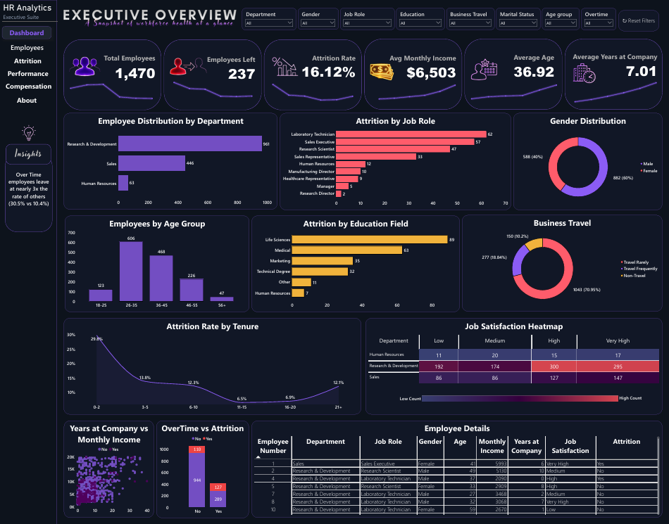
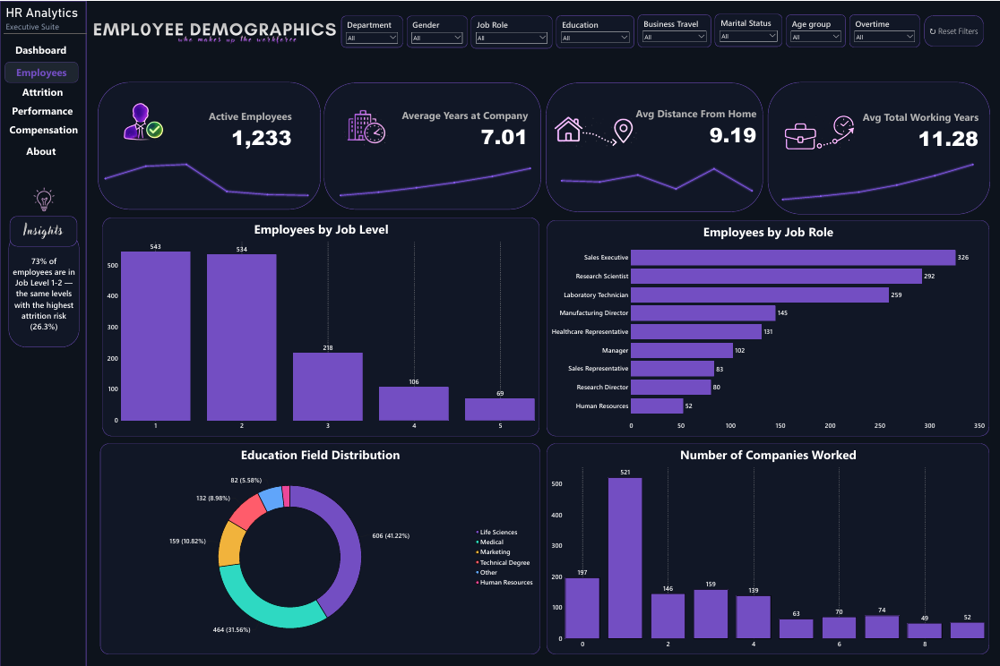
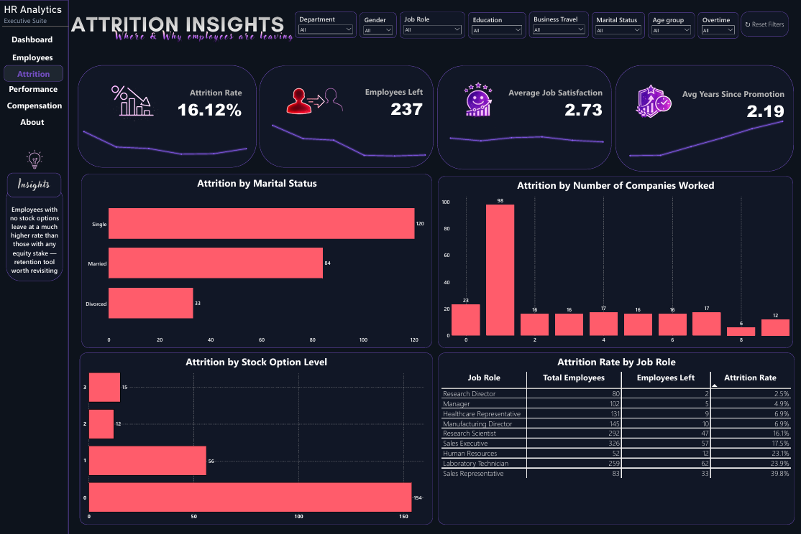
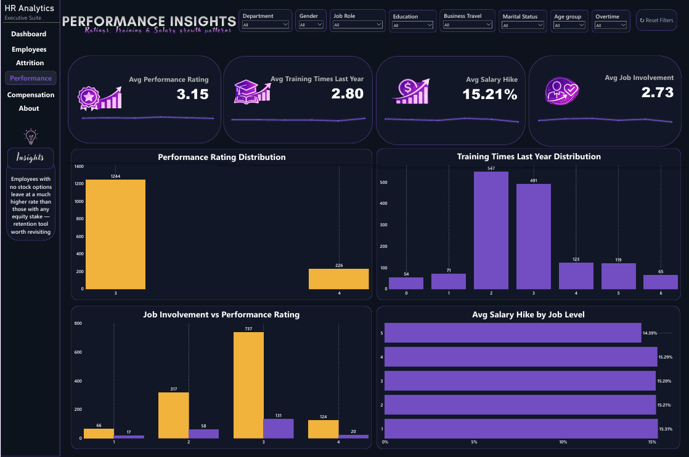
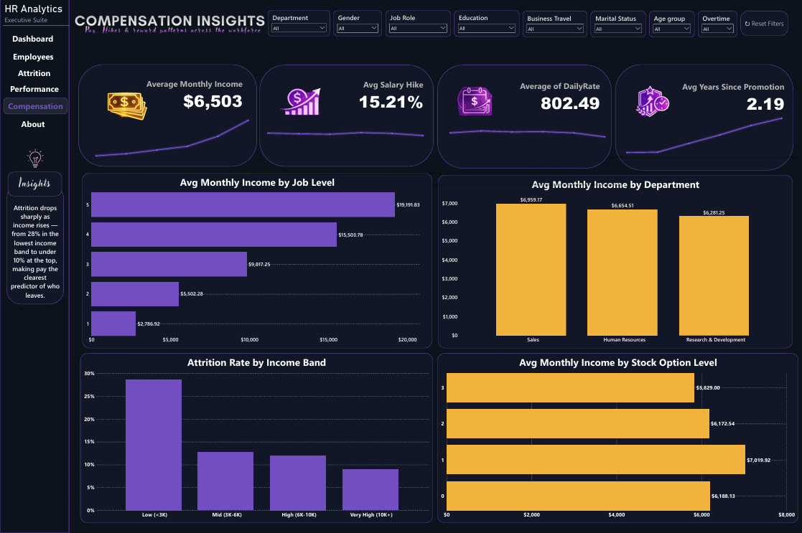

# HR Attrition Analytics Dashboard

A multi-page Power BI dashboard analyzing employee attrition, performance, and compensation trends using the IBM HR Analytics Employee Attrition & Performance dataset.

  

## Overview

This project transforms the classic IBM HR Attrition dataset into a polished, multi-page interactive Power BI dashboard. The goal was to move beyond a single-page report and build a full HR analytics suite — the kind of tool an HR or People Analytics team could actually use to spot attrition risk, track performance trends, and monitor compensation patterns across the workforce.

## Screenshots

**Executive Overview**

**Employee Demographics**

**Attrition Insights**

**Performance Insights**

**Compensation Insights**

## Data Source

- **Dataset:** IBM HR Analytics Employee Attrition & Performance
- **Records:** 1,470 employees
- **Source:** Kaggle

## Dashboard Pages

| Page | Description |
|------|-------------|
| **Dashboard** | Executive overview — key KPIs, attrition trends, and top insights |
| **Employees** | Workforce demographics and job-level distribution |
| **Attrition** | Deep dive into attrition drivers (overtime, stock options, etc.) |
| **Performance** | Performance ratings, training frequency, salary hikes, job involvement |
| **Compensation** | Pay and income analysis across roles and levels |
| **About** | Project overview, data source, tools, goals, and credits |

Each page includes a shared sidebar with:
- 8 slicers (Department, Gender, Job Role, Education, Business Travel, Marital Status, Age Group, OverTime)
- A "Reset Filters" bookmark button
- An "Insights" callout panel highlighting the page's key finding

## Key Insights

- **Overtime employees leave at nearly 3x the rate of others** (30.5% vs 10.4%)
- **73% of employees are in Job Level 1–2** — the same levels with the highest attrition risk (26.3%)
- **Employees with no stock options leave at a much higher rate** than those with any equity stake — a clear retention lever worth revisiting

## Key Metrics Tracked

Total Employees, Attrition Rate, Average Monthly Income, Average Age, Average Years at Company, Active Employees, Average Job Satisfaction, Average Performance Rating, Average Training Times, Average Salary Hike, Average Job Involvement, and more.

## Tools & Technologies

- **Power BI** — data modeling, DAX measures, report design
- **Deneb (custom visual)** — glow-line sparklines on KPI cards
- **DAX** — calculated columns (`TenureBucket`, `AgeGroup`, sort-order columns) and 15+ measures

## Design

Styled after a custom reference design, using a consistent dark theme:

| Element | Color |
|---|---|
| Background | `#0F1B2D` |
| Card Background | `#16233A` |
| Purple (primary) | `#8B5CF6` |
| Coral/Red (attrition/risk) | `#FF5C6C` |
| Teal (retained/stable) | `#2ED9C3` |
| Amber (highlight) | `#F2B33D` |

## Future Scope

- Predictive attrition modeling (ML integration)
- Automated data refresh from an HRIS source
- Manager-level drill-through pages

## File

- `HR_Attrition_Dashboard.pbix`

---

Dashboard built by **Sreelakshmi P S** | Power BI Portfolio Project
